#  Labo Active Directory Sécurisé

Déploiement, durcissement et audit de sécurité d'une infrastructure Active Directory en environnement virtualisé, incluant la simulation d'attaques réelles (Kerberoasting, AS-REP Roasting) et la mise en place de contre-mesures.

##  Objectif du projet

Ce projet a pour but de démontrer une compréhension complète du cycle de sécurité d'un domaine Active Directory : de sa construction à sa sécurisation, en passant par l'identification et l'exploitation de vulnérabilités réelles, jusqu'à leur correction.

##  Architecture

| Composant | Rôle | IP |
|---|---|---|
| Windows Server 2022 | Contrôleur de domaine (fst.ma) | 192.168.111.10 |
| Windows 10 (DESKTOP1) | Poste client, joint au domaine | 192.168.111.20 |
| Kali Linux | Machine attaquante | 192.168.111.x (DHCP) |

*Environnement virtualisé sous VMware Workstation, réseau NAT isolé.*

**Structure Active Directory**
- Unités d'Organisation : `LAB_Employees`, `LAB_Computers`, `LAB_Groups`
- Utilisateurs et comptes de service créés pour simuler un environnement d'entreprise réaliste

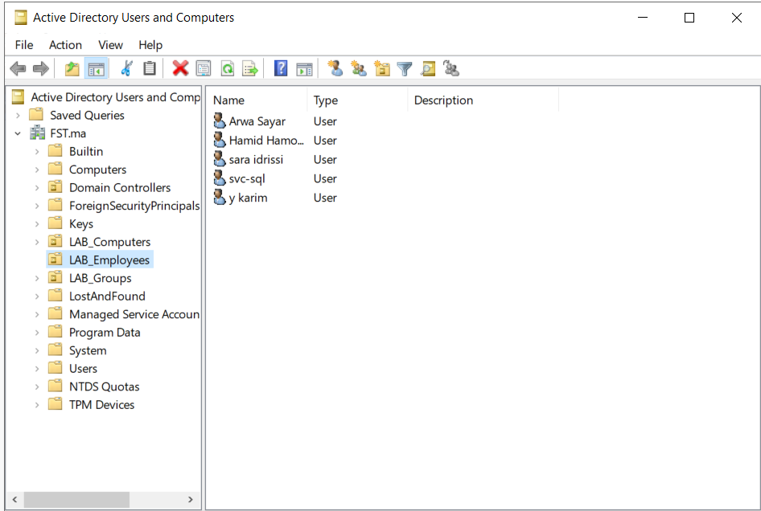

##  Étapes réalisées

### 1. Déploiement de l'infrastructure
- Installation et configuration de Windows Server 2022 comme contrôleur de domaine
- Création du domaine `fst.ma`, structuration en OU, création d'utilisateurs et de groupes
- Jonction d'un poste client Windows 10 au domaine

### 2. Durcissement de la sécurité

**Politique de mot de passe et SMBv1**
- Politique de mot de passe renforcée (longueur, complexité)
- Désactivation de SMBv1

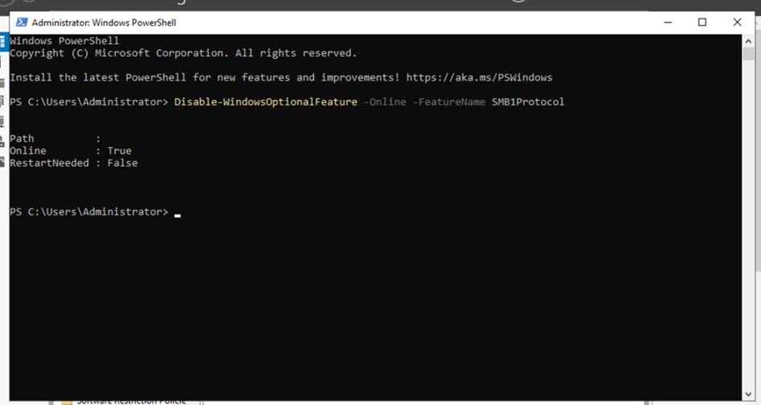

**LAPS (Local Administrator Password Solution)**

Mise en place de mots de passe administrateur locaux uniques et automatiquement renouvelés par machine :
- Extension du schéma Active Directory et délégation des permissions sur l'OU `LAB_Computers`
- Configuration via GPO dédiée

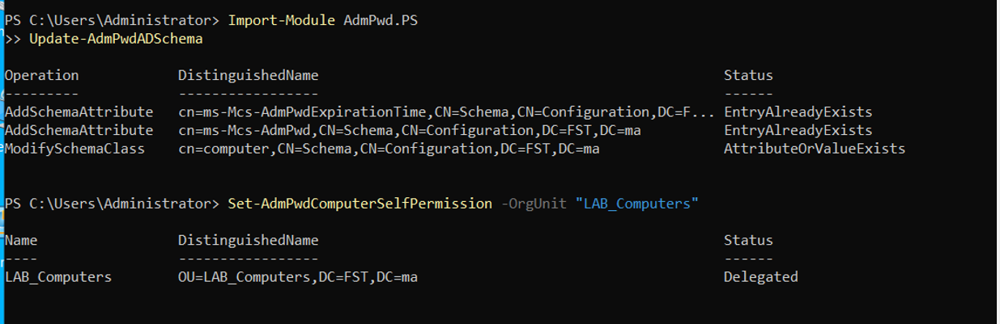
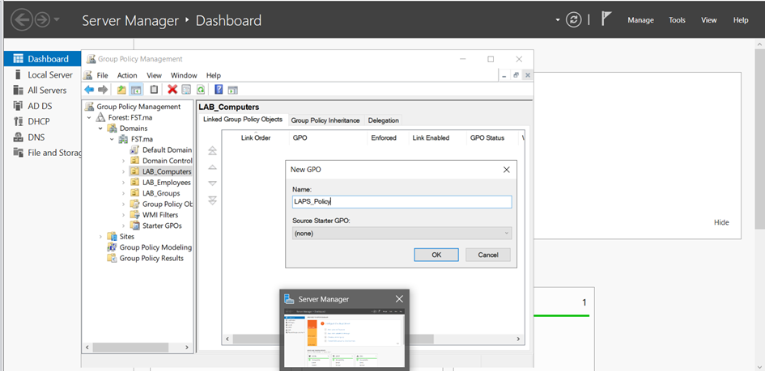
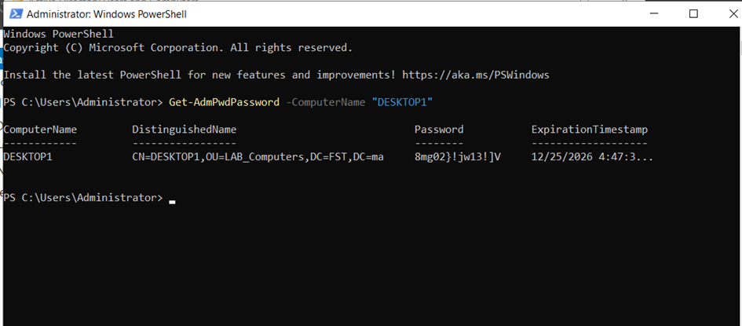

**Audit des connexions**

Activation de l'audit sur la validation des identifiants et les connexions/déconnexions, via une GPO liée à l'OU `LAB_Computers`.

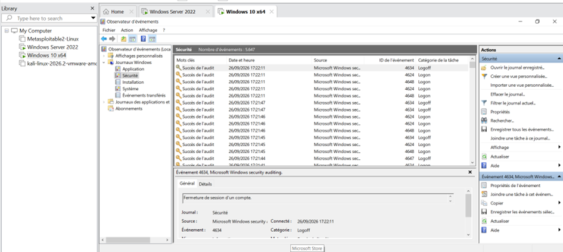

### 3. Simulation d'attaques

**Kerberoasting**

Création d'un compte de service avec SPN (`svc-sql`), puis extraction du ticket Kerberos depuis un compte utilisateur standard (sans privilège élevé), via Impacket depuis Kali.

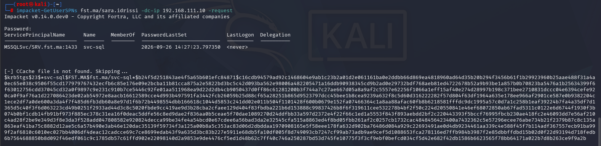

Tentative de cassage avec Hashcat sur la wordlist complète rockyou.txt (14M+ entrées) :

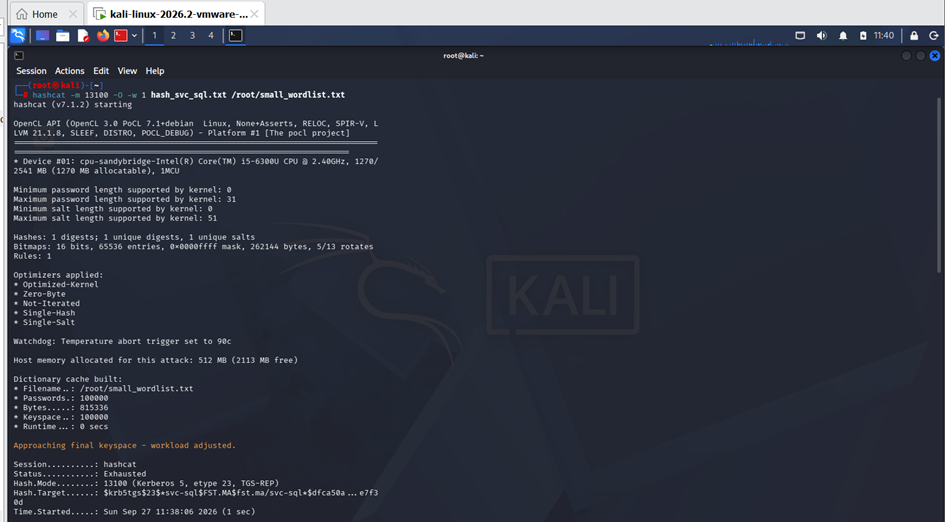
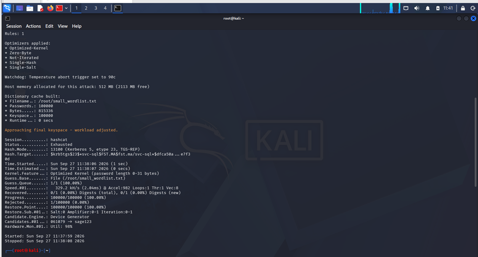
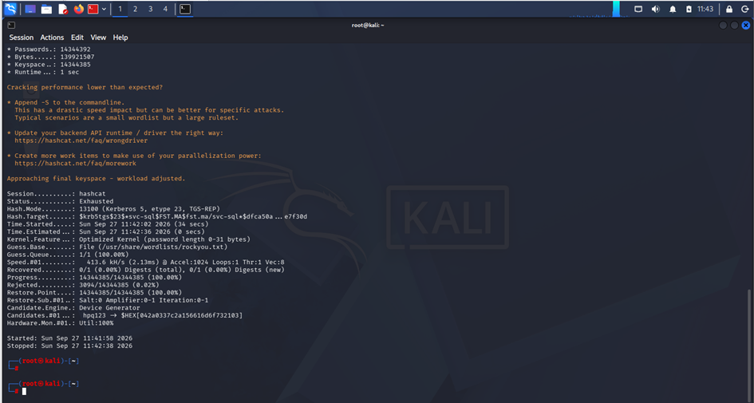

**Mot de passe non compromis**, malgré 14 millions de tentatives.

**AS-REP Roasting**

Création d'un compte (`y.karim`) avec la pré-authentification Kerberos désactivée, permettant l'extraction d'un hash **sans aucun identifiant valide**.

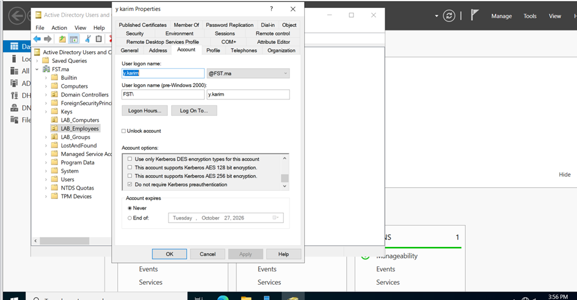
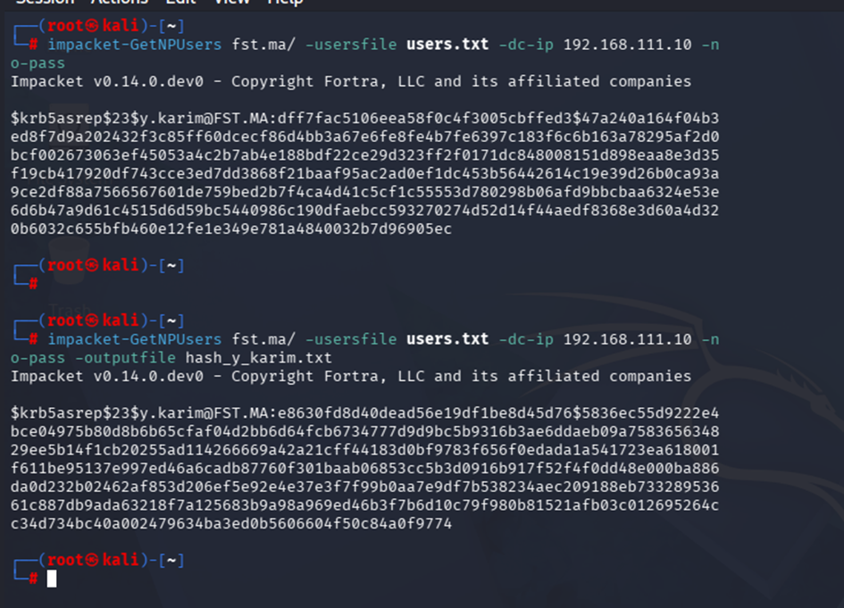

Tentative de cassage avec Hashcat :

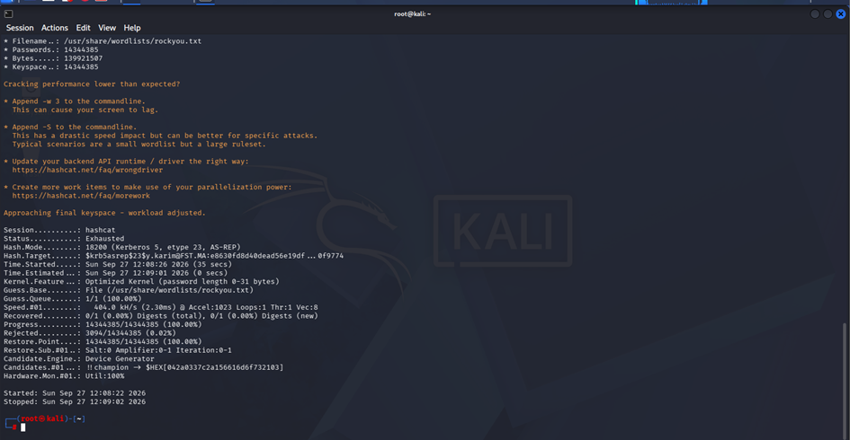

**Mot de passe non compromis.**

**Contre-mesure appliquée** : réactivation de la pré-authentification sur `y.karim`, puis vérification qu'une nouvelle tentative d'attaque est bien bloquée.

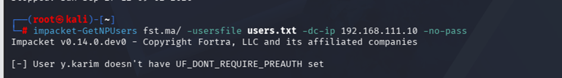
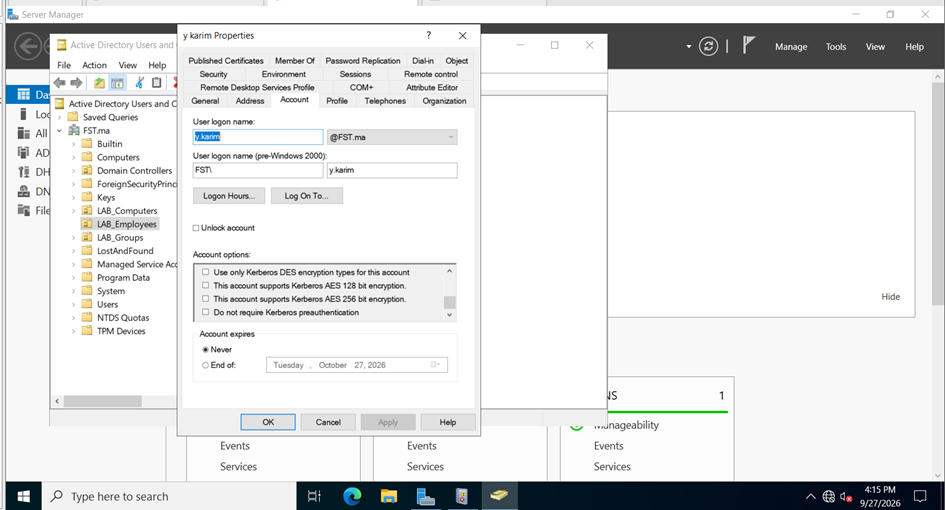

### 4. Détection

Vérification des traces des deux attaques dans l'Observateur d'événements Windows (Event ID 4768, 4769).

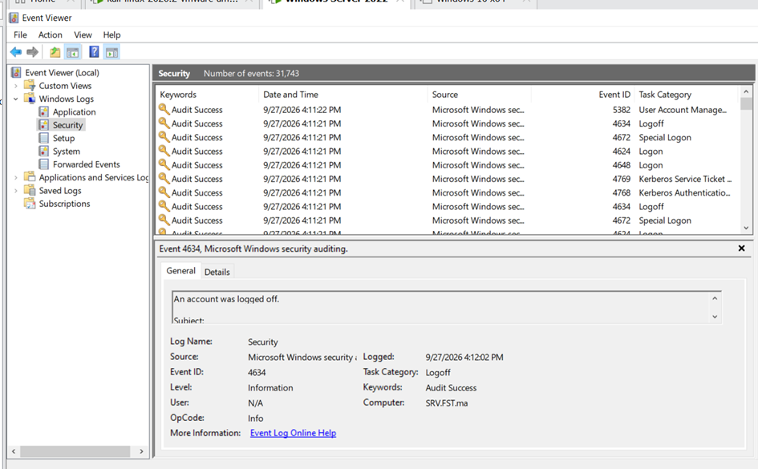

##  Résultats

| Attaque | Extraction du ticket | Mot de passe cassé | Contre-mesure |
|---|---|---|---|
| Kerberoasting |  Réussie |  Non (mot de passe robuste) | Politique de mot de passe |
| AS-REP Roasting |  Réussie |  Non (mot de passe robuste) | Pré-authentification réactivée |

##  Analyse des résultats

**Kerberoasting**

Le compte de service `svc-sql`, configuré avec un SPN, s'est révélé vulnérable au Kerberoasting (extraction réussie du ticket Kerberos chiffré depuis un compte utilisateur standard, sans privilège élevé). Cependant, la tentative de cassage du mot de passe via Hashcat, avec la wordlist complète rockyou.txt (14+ millions d'entrées), n'a abouti à aucun résultat, démontrant l'efficacité de la politique de mot de passe robuste (14+ caractères, complexité) appliquée au domaine, même face à cette attaque.

**AS-REP Roasting**

Le compte `y.karim`, configuré volontairement avec la pré-authentification Kerberos désactivée, a permis l'extraction d'un hash sans aucun identifiant valide, illustrant qu'un attaquant externe pourrait exploiter cette faille sans jamais être authentifié. Comme pour le Kerberoasting, le cassage du mot de passe a échoué face à Hashcat. La contre-mesure (réactivation de la pré-authentification) a ensuite été appliquée et vérifiée efficace : une nouvelle tentative d'attaque a été bloquée avec succès.

##  Outils utilisés

Windows Server 2022 · Active Directory · Group Policy · LAPS · Kali Linux · Impacket · Hashcat · VMware Workstation

##  Ce que ce projet démontre

- Capacité à déployer et administrer une infrastructure Active Directory de bout en bout
- Compréhension des vecteurs d'attaque courants sur Kerberos et leur exploitation réelle
- Mise en œuvre de mesures de durcissement alignées avec les bonnes pratiques (LAPS, politique de mot de passe, audit)
- Démarche complète d'un audit de sécurité : attaque → détection → correction → vérification

## 🚀 Prochaines étapes

Ce projet s'inscrit dans une série de labos personnels autour des réseaux et de la cybersécurité :
- **Mini SOC avec Wazuh** : détection en temps réel des attaques simulées dans ce labo
- **Réseau d'entreprise segmenté avec pfSense** : VLAN, DMZ, VPN

## 📫 Contact

**Doaa Jdi** — Étudiante en Master Réseaux & Télécommunications, à la recherche d'un stage PFE en Réseaux / Cybersécurité
- LinkedIn : [ton lien LinkedIn]
- Email : jdidoaa53@gmail.com
